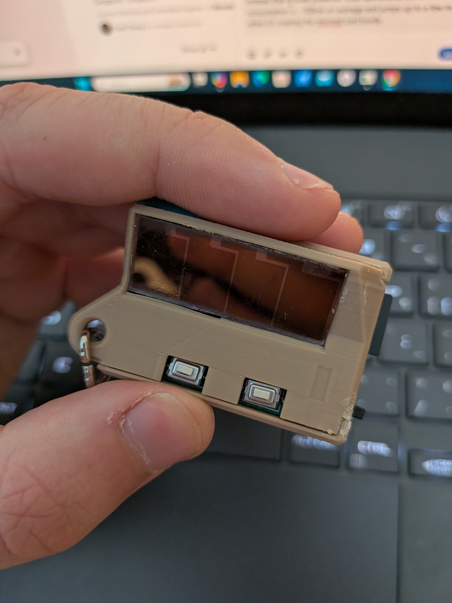
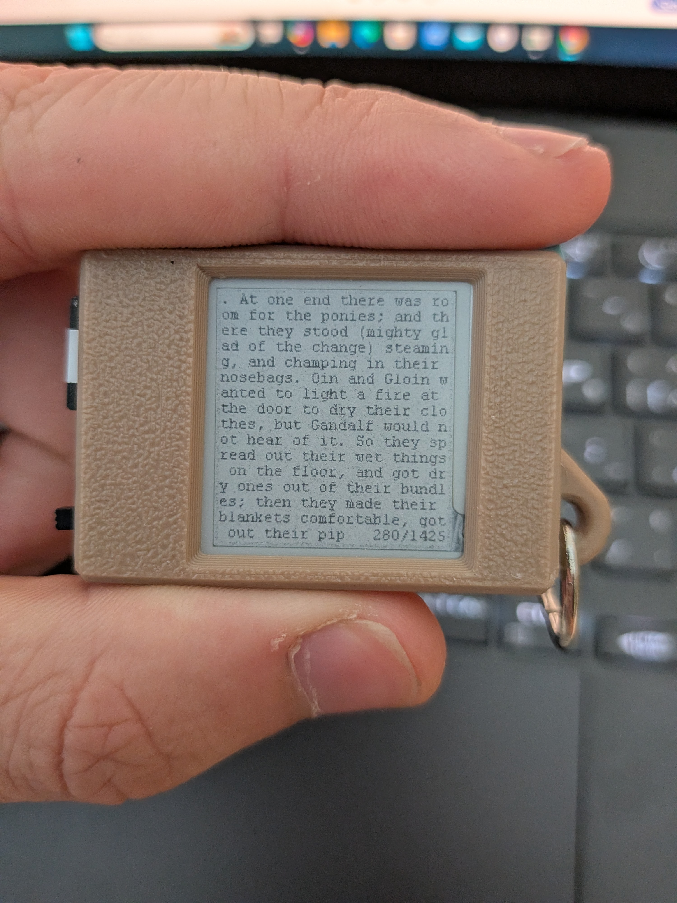

Solar Powered E-Reader Keychain 

Has a custom E-Paper driver circuit MicroSD card interface and solar energy harvesting circuit.

Based on the STM32U073 with sub 1 μW operational power consumption.

Has a custom FILEX implementation that supports EXfat and fat32 file systems (Supports SDUC, SDXC and SDHC), 3d printed Case design and a custom EPD lookup table for the 1.22 inch E paper display.

Power consumption is so low this design is battery free with a supercap to store charge for brief current spikes from microSD card reads.
 
 You can select a text file to read, jump to a specific page, and adjust the font size
 
 
